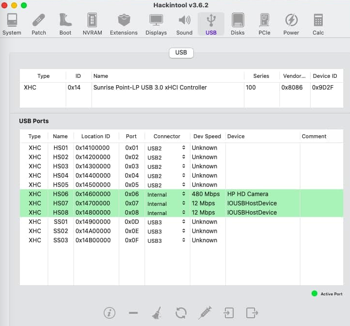
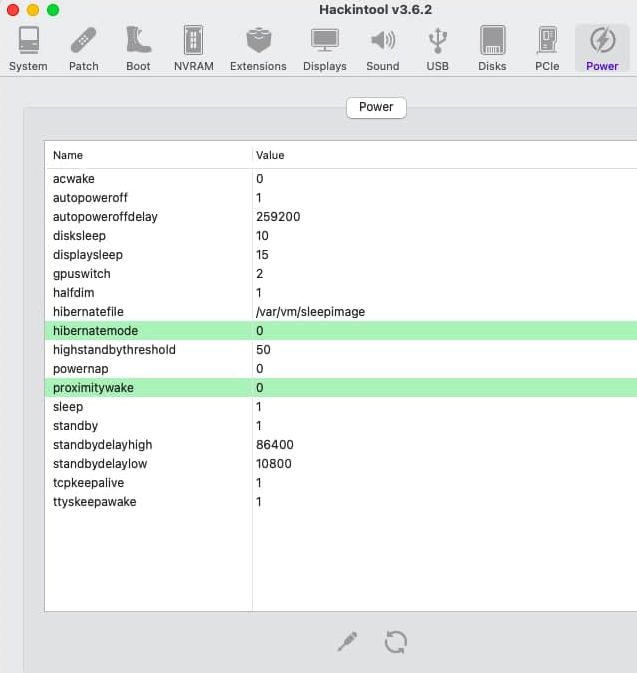

HP Probook 430 G3 to run macOS
============================================

- Bootloader version: Opencore 0.7.4
- macOS version: macOS Big Sur 11.6 (20G165)
- Windows version: Windows 11 Release

#### What works

- iGPU acceleration (Intel HD 520)
- Sleep
- Battery Percentage
- Display Brightness
- USB ports
- Internal Camera
- Audio with mute button (Both internal speakers and Microphone CX20724)
- Native Power Management/(Also with cpufriend)
- SMBus Controller
- WI-FI + BT Intel
- CPU Temperature Monitoring
- Fan Speed Monitoring
- VGA (*suprisingly*)
- Three Finger Gestures
- Boot Chime
- Dualbooting with Windows
- iMessage
- Facetime

#### Specs

| Component      | Brand                                                            |
|----------------|------------------------------------------------------------------|
| **CPU**        | `Intel Core i5-6200U `                                           |   
| **iGPU**       | `Intel HD Graphics 520 `                                         |
| **Audio**      | `Conexant 20724 - layout 3`                                      |
| **Ethernet**   | `Realtek RTL8111/8168`                                           |
| **OS**         | `macOS Big Sur 11.6 (20G165)` and `Windows`           |

#### USBMap

#### Power

#### HDMI 

#### Making the Three Finger Gestures Work

- Open System Preferences->Keyboard->Shortcuts

- Double-tap on shortcut you want it to perform.
- Do the Three Finger Gesture to set it.
- Voila! You're Done!

#### Benchmarks
- Geekbench 5 [Multi-core and Single core](https://browser.geekbench.com/v5/cpu/8013906)

#### Important
- In the config.plist, section `PlatformInfo > Generic`, the following fields are currently edited with CHANGEME. Please generate your own serial. 

- This repo can be helpful for other HP Probook/Elitebook series notebooks
 
### Bios Configuration

#### Enable
- Fast Boot
- Runtime Power Management
- Extended Idle Power States
- Deep Sleep
- Power Control
- Turbo Boost
- Virtualization Technology (VTx)
- Hyperthreading
- Multi Processor

 #### Disable 
- Legacy boot
- Wake when lid is opened
- Wake on USB

#### Having some problem
Create an issue and I'll try to help as many as I can

#### Credits
- [Apple](https://apple.com) for [macOS](https://www.apple.com/macos/big-sur/)
- [Acidanthera](https://github.com/Acidanthera) for [OpenCorepkg](https://github.com/acidanthera/OpenCorePkg) and necessary kexts
- [Krazy-Killa](https://github.com/Krazy-Killa) for the Three finger gestures
- [dortania](https://github.com/dortania) for its detailed guides

